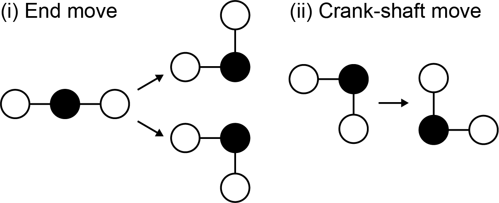

<!--<style TYPE="text/css">
code.has-jax {font: inherit; font-size: 100%; background: inherit; border: inherit;}
</style>
<script type="text/x-mathjax-config">
MathJax.Hub.Config({
    tex2jax: {
        inlineMath: [['$','$'], ['\\(','\\)']],
        skipTags: ['script', 'noscript', 'style', 'textarea', 'pre'] // removed 'code' entry
    }
});
MathJax.Hub.Queue(function() {
    var all = MathJax.Hub.getAllJax(), i;
    for(i = 0; i < all.length; i += 1) {
        all[i].SourceElement().parentNode.className += ' has-jax';
    }
});
</script>
<script type="text/javascript" src="https://cdnjs.cloudflare.com/ajax/libs/mathjax/2.7.4/MathJax.js?config=TeX-AMS_HTML-full"></script>-->

# RL-Fold

Fold 2D HP chains using reinforcement learning. A work in progress.


Dependencies
-----------------------------------------------------------------------------------------------
Currently depends on [HPSandbox](https://github.com/vvoelz/HPSandbox).

Moves
-----------------------------------------------------------------------------------------------
This implementation is currently limited to two-dimensional chains. The size of the grid may be set by the user. 

A residue in a chain may execute one of the following moves: (i) an end-move or (ii) crank-shaft.




<!--Note that anytime a move is performed, the configuration is ``standardized'' in the following way. Consider a residue moving from (x_i, y_i) to (x_f, y_f). The chain is then translated such that the first and second residue (measured from the same end of the chain) are repositioned at (0,0) and (1,0). Then, the first non-collinear residue thereafter is placed in the first quadrant, and the rest of the chain is moved accordingly. 
-->

Objective
-----------------------------------------------------------------------------------------------
Find a policy $\pi^*$ that folds an HP chain into a ground state in as few moves as possible. The ground state(s) of a chain having some sequence are the configurations having the maximum possible number of hydrogen bonds.

Options
-----------------------------------------------------------------------------------------------
Consider a simple HP chain with sequence HHPHH. 

Generate a configuration for the chain (relies on HPSandbox) -- 

```
cd examples
sh make_config.sh
cd .. 
```

Next, sample all configurations that are accessible via the move set

```
python config_generator.py --chain_length 5 --grid_size 7 --conf_dir examples --draw True
```

which should print out 13. A file containing the configurations is saved in the default directory, here /examples/5, along with configuration images and a movie.

Finally, compute the optimal policy using value iteration

```
python iteration.py -s HHPHH --draw True --verbose True
```